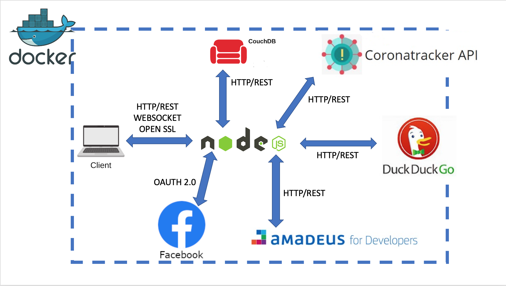

# SafeTravel
## 1. Scopo del progetto:
SafeTravel dà agli utenti informazioni sugli itenerari di volo e sui casi attivi di COVID-19 nella città di destinazione.  
L'utente può salvare tra i preferiti gli itinerari di volo e può condividerli con gli amici su Facebook.  
SafeTravel fornisce anche una lista di "mete proposte", ovvero le mete più scelte dagli altri utenti, che viene aggiornata in tempo reale.
## 2. Architettura di riferimento e tecnologie utilizzate:

## 3. Soddisfacimento dei requisiti:
* API offerte a terze parti e documentate mediante [ApiDoc](https://localhost:3000/api);
* Servizi REST di terze parti: CouchDB, Coronatracker API, DuckDuckGo, Amadeus, Facebook;
* Servizio OAuth: Facebook per login e condivisione post;
* Protocollo asincrono: WebSocket che aggiorna le mete proposte in real-time;
## 4. Istruzioni per l'installazione
1) Aprire un terminale nella directory principale (dove si trova il file **docker-compose.yml**) ed eseguire i comandi:  
<code>docker-compose build</code>  
<code>docker-compose up -d</code>  
2) Dal browser visitare [questa pagina](https://localhost:3000/);
4) Per fermare il server eseguire il comando: <code>docker-compose down</code> (questo fermerà i container di CouchDB e Node);
5) Per riavviare il server eseguire il comando: <code>docker-compose up</code> (questo avvierà i container di CouchDB e Node).
